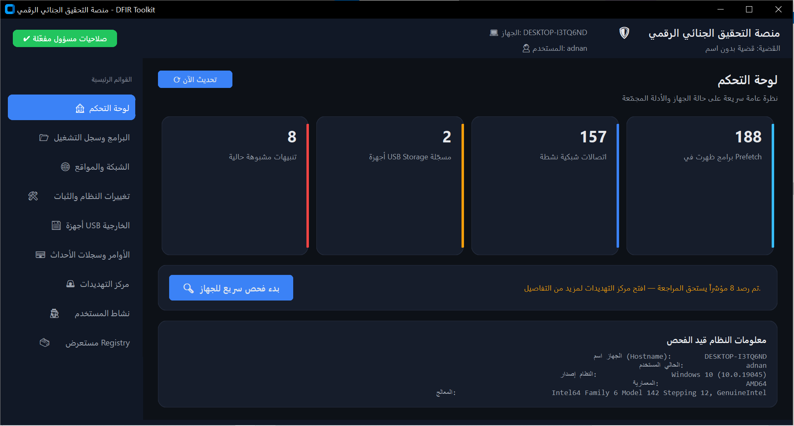
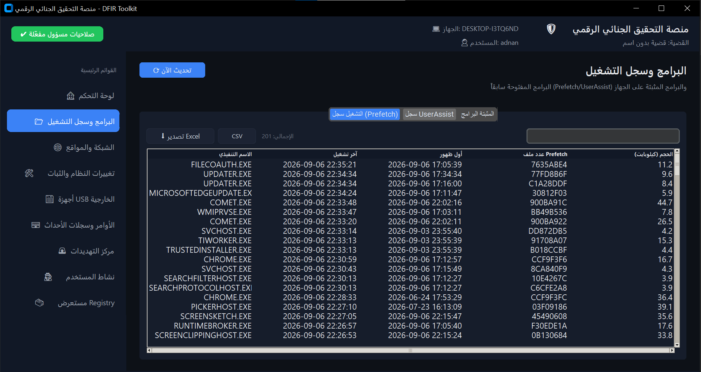
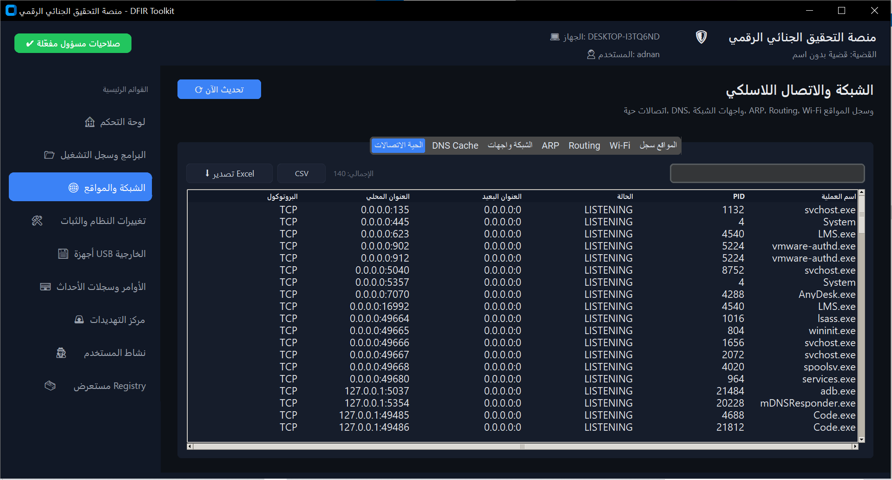
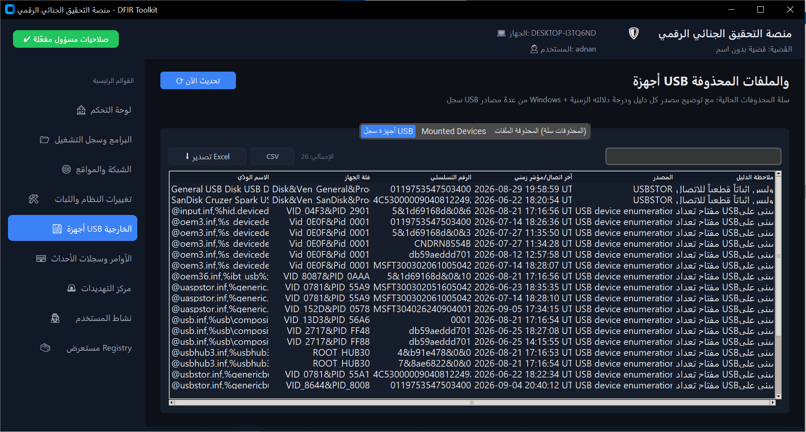
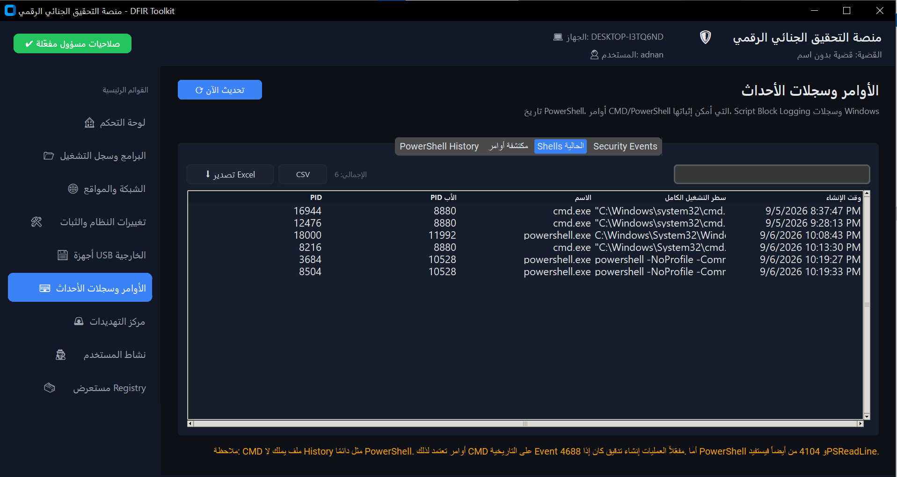
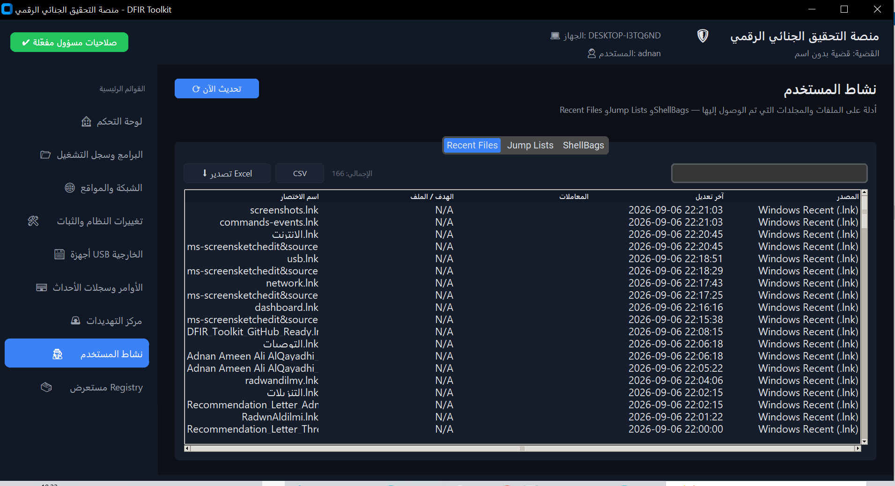
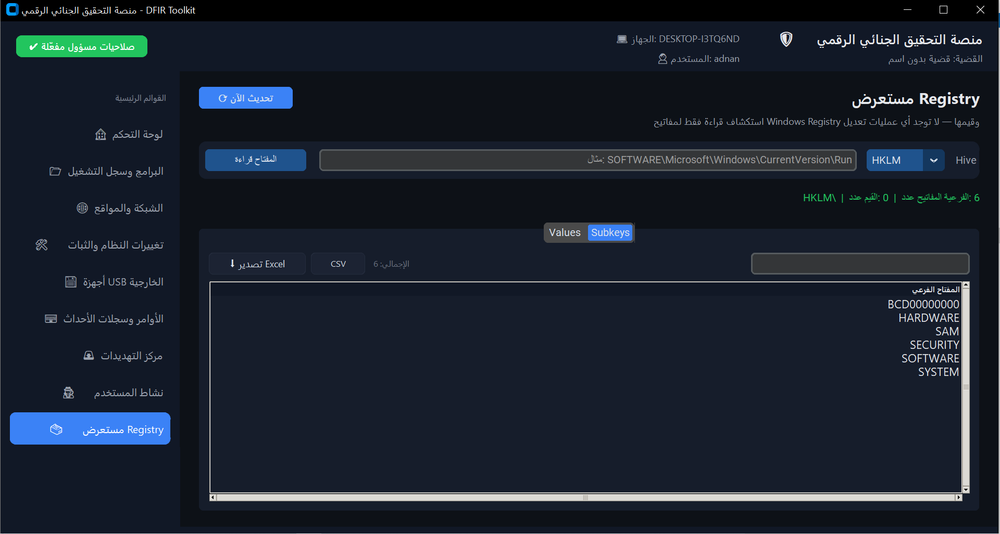
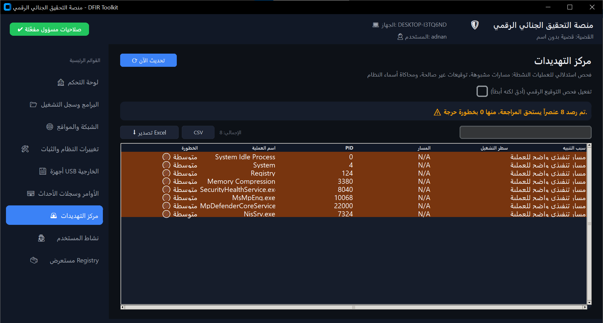

# 🛡️ DFIR Toolkit


**DFIR Toolkit** is a Windows-focused desktop application for **Digital Forensics and Incident Response (DFIR)** and **Live Triage**.

It provides a graphical interface for collecting and reviewing multiple Windows forensic artifacts from one place, including user activity, Windows Registry, USB history, network activity, Wi-Fi information, browser history, PowerShell/CMD activity, Windows Event Logs, persistence mechanisms, and basic process threat triage.

> **Project status:** DFIR Toolkit is an investigative triage tool and is not intended to replace full forensic disk imaging, memory acquisition, or specialized forensic suites.

---
## 📸 Screenshots

> A visual overview of the DFIR Toolkit interface and its main investigation modules.

### 🖥️ Main Dashboard




### 📊 Excel Export


### 🌐 Network & Wi-Fi Forensics



### 🔌 USB & Deleted Items



### ⌨️ Commands & Windows Events



### 🗃️ User Activity



### 🧾 Registry Explorer



### 🚨 Threat Center




## ✨ Features

### 🕵️ User Activity

Collects several artifacts that can help reconstruct user activity:

- Windows Recent Files (`.lnk`)
- Jump Lists:
  - `AutomaticDestinations`
  - `CustomDestinations`
- ShellBags / `BagMRU`
- File and folder paths extracted from available artifacts
- Source paths and timestamps where available

The implementation intentionally labels Jump Lists and ShellBags parsing as **best-effort** rather than claiming to be a complete parser for every Windows version and artifact structure.

---

### 📦 Application & Execution Evidence

The toolkit collects:

- Windows Prefetch metadata
- UserAssist
- Installed applications
- Current CMD / PowerShell / PowerShell Core processes
- Process ID and Parent Process ID
- Command-line information where available

These artifacts can help answer questions such as:

- Which applications were executed?
- Which programs are installed?
- Which shell processes are currently running?
- What command line was associated with a process?

---

### ⌨️ Command & PowerShell Investigation

DFIR Toolkit separates command evidence by source instead of assuming that Windows has one universal command history.

#### PowerShell

- PSReadLine history
- PowerShell Script Block Logging — Event ID `4104`
- Current `powershell.exe` / `pwsh.exe` processes
- Full command line where Windows exposes it

#### CMD

Classic CMD does not normally maintain a persistent history file comparable to PSReadLine.

Therefore the toolkit uses **Security Event ID `4688` (Process Creation)** when process creation auditing is enabled.

This allows the investigator to review command-line evidence for:

- `cmd.exe`
- `powershell.exe`
- `pwsh.exe`

---

### 🌐 Network Forensics

The network module collects:

- Active TCP connections
- Active UDP connections
- Local and remote addresses
- Connection state
- PID
- Process name
- DNS cache
- Network interfaces
- IPv4 addresses
- IPv6 addresses
- DNS servers
- Network profiles
- ARP table
- IPv4 routing table

This makes it possible to correlate:

```text
Process → PID → Network Connection → Remote Address
```

---

### 📶 Wi-Fi Investigation

The toolkit can collect available Wi-Fi information through Windows networking tools.

It includes:

- Current Wi-Fi interface information
- SSID
- BSSID
- Connection state
- Authentication
- Radio type
- Channel
- Signal
- Receive/transmit rates where available
- Saved Wi-Fi profile names

> **Privacy / safety:** the application does **not** display saved Wi-Fi passwords.

---

### 🌍 Browser History

The browser collector supports:

- Google Chrome
- Microsoft Edge
- Mozilla Firefox

Depending on browser availability, it can collect:

- URLs
- Page titles
- Visit counts
- Last visit timestamps

For Chromium-based browsers, the history database is copied to a temporary location before reading it, reducing the need to access the live database directly.

---

### 🔌 USB Forensics

USB history does not rely on `USBSTOR` alone.

The toolkit checks multiple Windows artifacts, including:

- `USBSTOR`
- USB device enumeration
- `MountedDevices`
- Windows SetupAPI device-install logs when available

The interface identifies the **evidence source** for each result.

Potentially useful information includes:

- Device class
- Friendly name
- Manufacturer
- Serial / instance information
- Registry path
- Last-write information
- Evidence source

> **Important:** Registry Last Write timestamps should not automatically be interpreted as the exact physical moment a USB device was connected. They are forensic indicators that should be correlated with other evidence.

---

### 🗑️ Recycle Bin / Deleted-Item Evidence

The toolkit examines Windows Recycle Bin metadata and can identify:

- Original file path
- Deleted timestamp
- File size
- Associated `$R` data where available
- Whether the associated Recycle Bin content is still present

This is **not** full NTFS deleted-file recovery.

It does not replace:

- MFT analysis
- USN Journal analysis
- File carving
- Full disk forensic acquisition

---

### 🛠️ Persistence Investigation

The persistence module checks several common Windows persistence locations:

#### Registry

- `HKLM\...\Run`
- `HKLM\...\RunOnce`
- `HKCU\...\Run`
- `HKCU\...\RunOnce`

#### Services

Collects information about Windows services, including:

- Name
- Display name
- State
- Start mode
- Executable path

#### Scheduled Tasks

Uses Windows Scheduled Task information to collect:

- Task name
- Status
- Last run
- Next run
- Run-as account
- Action / executable information

---

### 🧾 Windows Event Logs

The toolkit collects selected security and system events useful for incident investigation.

Examples include:

- `4624` — Successful logon
- `4625` — Failed logon
- `4688` — Process creation
- `4720` — User account creation
- `1102` — Security audit log cleared
- `7045` — Service installation

PowerShell `4104` Script Block Logging is also supported when the relevant logging policy is enabled.

---

### 🗃️ Read-Only Windows Registry Explorer

A dedicated Registry Explorer allows investigators to inspect:

- `HKLM`
- `HKCU`
- `HKCR`
- `HKU`
- `HKCC`

It displays:

- Registry values
- Value types
- Value data
- Subkeys

The Registry Explorer is designed as **read-only**.

It does not intentionally modify or delete Registry keys or values.

---

### 🚨 Threat Center

The Threat Center performs **heuristic process triage**.

It can flag indicators such as:

- Executables running from suspicious locations
- Processes resembling common Windows system process names
- Suspicious or missing executable information
- Digital signature indicators when deep signature checking is enabled

The purpose is to prioritize items for investigation.

> **This is not an antivirus engine.** A finding does not prove that a file or process is malicious, and the absence of a finding does not prove that a system is clean.

---

## 📊 Excel & CSV Export

Every major table supports data export.

### Excel (`.xlsx`)

The toolkit generates structured Excel workbooks with:

- Real separate columns
- Arabic/RTL-friendly layout
- Formatted headers
- AutoFilter
- Frozen header row
- Wrapped text
- Adjusted column widths
- Excel table formatting
- Current filtered/visible results

This avoids the common problem where CSV content opens in Excel as one long column because of locale-specific delimiter handling.

### CSV

CSV export is also available for interoperability with other tools.

---

## 🖥️ Interface

The application uses a graphical interface built with **CustomTkinter**.

Main sections include:

| Section | Purpose |
|---|---|
| Dashboard | Quick system triage and host information |
| Applications | Prefetch, UserAssist and installed applications |
| Network & Wi-Fi | Connections, DNS, interfaces, ARP, routing and Wi-Fi |
| System Changes | Persistence, services and scheduled tasks |
| USB & Deleted Items | USB history and Recycle Bin artifacts |
| Commands & Events | PowerShell/CMD evidence and Windows events |
| Threat Center | Heuristic process triage |
| User Activity | Recent Files, Jump Lists and ShellBags |
| Registry Explorer | Read-only Registry investigation |

The current interface is primarily Arabic/RTL.

---

## 🏗️ Architecture

The project separates the graphical interface from the forensic collection layer.

```text
DFIR_Toolkit/
│
├── main.py
├── requirements.txt
├── README.md
├── شغل_البرنامج.bat
│
└── app/
    │
    ├── core/
    │   ├── system_info.py
    │   ├── threading_utils.py
    │   ├── error_log.py
    │   │
    │   └── forensics/
    │       ├── browser_history.py
    │       ├── command_history.py
    │       ├── deleted_files.py
    │       ├── event_logs.py
    │       ├── installed_programs.py
    │       ├── network.py
    │       ├── persistence.py
    │       ├── prefetch.py
    │       ├── recent_activity.py
    │       ├── registry_explorer.py
    │       ├── shellbags.py
    │       ├── threat_detection.py
    │       ├── usb_history.py
    │       └── userassist.py
    │
    └── ui/
        ├── header.py
        ├── main_window.py
        ├── sidebar.py
        ├── statusbar.py
        ├── theme.py
        ├── widgets.py
        │
        └── views/
            ├── dashboard_view.py
            ├── apps_view.py
            ├── network_view.py
            ├── system_changes_view.py
            ├── usb_view.py
            ├── commands_events_view.py
            ├── registry_view.py
            ├── threat_center_view.py
            └── user_activity_view.py
```

---

## ⚙️ Requirements

### Operating System

- Windows 10
- Windows 11

### Python

- Python 3.10+

### Python Packages

```text
customtkinter>=5.2.2
pillow>=10.0.0
pywin32>=306
openpyxl>=3.1.5
```

---

## 🚀 Installation

Clone the repository:

```bash
git clone https://github.com/YOUR_USERNAME/DFIR_Toolkit.git
cd DFIR_Toolkit
```

Install the dependencies:

```bash
python -m pip install -r requirements.txt
```

Run the application:

```bash
python main.py
```

### Windows quick start

You can also run:

```text
شغل_البرنامج.bat
```

The launcher checks for the required packages and attempts to install missing dependencies before starting the application.

---

## 🔐 Recommended Permissions

Running the application **as Administrator** is recommended when performing live triage.

Some Windows artifacts are restricted by:

- Registry permissions
- Security Event Log permissions
- User profile boundaries
- Windows security policies
- Process access restrictions

Without elevated privileges, some collectors may return incomplete results.

---

## 🔎 Investigation Workflow

A typical investigation can follow this workflow:

```text
1. Start a new case
        ↓
2. Review system information
        ↓
3. Check applications and execution artifacts
        ↓
4. Review user activity
        ↓
5. Investigate network and Wi-Fi activity
        ↓
6. Review USB devices
        ↓
7. Investigate CMD / PowerShell activity
        ↓
8. Review Windows Event Logs
        ↓
9. Check persistence mechanisms
        ↓
10. Review Threat Center findings
        ↓
11. Export relevant evidence to Excel/CSV
```

---

## ⚠️ Forensic Limitations

DFIR Toolkit is designed primarily for **live triage and evidence review**.

Important limitations:

### Live system impact

Running forensic software on a live system can change system state. For strict forensic acquisition, use an appropriate forensic imaging and evidence-preservation workflow.

### Prefetch

Prefetch collection in this project is not intended to replace a full Prefetch parser. File metadata and available information should be interpreted carefully.

### USB timestamps

Registry Last Write timestamps are indicators and should not automatically be treated as exact device connection times.

### CMD history

Classic CMD does not provide a universal persistent history file. Historical CMD command evidence depends heavily on Windows auditing, especially Event `4688`.

### PowerShell

PSReadLine history and Event `4104` are different evidence sources and can both be incomplete if logging was disabled, cleared, or never configured.

### Browser history

Browser databases can be incomplete, locked, deleted, or affected by browser privacy settings.

### ShellBags / Jump Lists

These collectors use conservative/best-effort extraction and should not be considered complete parsers for every Windows artifact structure.

### Threat Center

Heuristic detections are indicators for investigation, not proof of compromise.

### Deleted files

Recycle Bin analysis is not equivalent to recovering all deleted NTFS files.

---

## 🧪 Development & Testing

The project is intended to run on Windows because its primary evidence sources are Windows-specific.

Examples:

```text
Windows Registry
Windows Event Logs
Prefetch
USBSTOR
SetupAPI
netsh
netstat
PowerShell
Scheduled Tasks
Services
ShellBags
Jump Lists
```

For development outside Windows, collectors that depend on Windows APIs are expected to be unavailable.

---

## 🗺️ Roadmap

Possible future development areas:

- [ ] Unified forensic timeline
- [ ] Case management and persistent case database
- [ ] Evidence hashing with SHA-256
- [ ] Chain of custody records
- [ ] Process tree visualization
- [ ] Advanced process intelligence
- [ ] IOC scanner
- [ ] MITRE ATT&CK mapping
- [ ] Sigma rule support
- [ ] YARA scanning
- [ ] PE/file metadata analysis
- [ ] Windows authentication investigation
- [ ] WMI persistence detection
- [ ] Shadow Copy analysis
- [ ] Advanced NTFS artifacts
- [ ] Memory forensics integration
- [ ] Automated HTML/PDF investigation reports
- [ ] Investigation graph
- [ ] Offline evidence-image analysis
- [ ] Optional threat-intelligence enrichment

---

## 🛡️ Security & Privacy

DFIR Toolkit is designed around local Windows evidence collection.

The core collectors do not require sending forensic data to a remote server.

Any future online threat-intelligence integration should be treated as an **optional enrichment feature**, especially when handling sensitive investigations.

Do not upload confidential evidence, credentials, private documents, or personally identifiable information to third-party services without appropriate authorization.

---

## ⚖️ Responsible Use

This project is intended for:

- Authorized incident response
- Digital forensic investigations
- Security research
- Defensive security
- SOC/DFIR training
- Lab environments
- Security education

Only use the toolkit on systems and data that you are authorized to examine.

---

## 📄 License

Choose and add an appropriate open-source license before publishing the repository.

For example:

```text
MIT License
```

If you use the MIT License, add a `LICENSE` file containing the official MIT license text and replace the placeholder above with the copyright holder/year.

---

## 👨‍💻 Project

**DFIR Toolkit**  
Windows Digital Forensics & Incident Response / Live Triage Toolkit

Built with:

- Python
- CustomTkinter
- Windows Registry APIs
- PowerShell
- Windows Event Logs
- SQLite browser databases
- OpenPyXL

---

## ⭐ Contributing

Contributions are welcome.

Recommended contribution areas:

1. Improve Windows artifact parsers.
2. Add forensic validation and test fixtures.
3. Improve timestamp interpretation.
4. Add new detection rules.
5. Improve localization support.
6. Add unit tests for collectors.
7. Improve Excel/report generation.
8. Add offline evidence support.

When contributing, avoid introducing destructive operations into forensic collectors. Collection modules should remain **read-only** unless a feature explicitly requires another behavior and clearly documents its impact.
